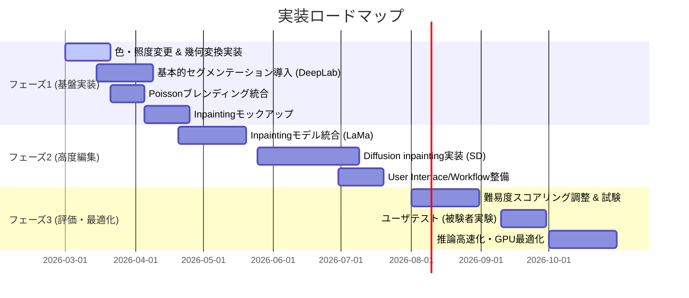

# エグゼクティブサマリ  
画像処理による間違い探し生成システムでは、入力画像の**セマンティックセグメンテーション**により対象領域を抽出し、それらの領域から**サリエンシーマップ／視線予測**等で注目度を評価して**難易度スコア**を設計・付与し、**色変化・幾何変換・画像補完・生成モデル**などの**編集手法**を適用して差分画像を生成する。セグメンテーションではDeepLabv3+（VOC89.0％／Cityscapes82.1％ mIoU）【12†L21-L27】、SegFormer（ADE20K 50.3％、Cityscapes 84.0％ mIoU）【15†L61-L69】、Mask2Former（ADE20K 57.7％）【5†L103-L107】などの最新モデルが利用可能であり、Mask2Formerは汎用的で高精度【5†L103-L107】、SegFormerは軽量・効率的【15†L61-L69】、DeepLab系は堅牢性が高い。サリエンシー検出では、U^2-Net（176MBモデル：30FPS、4.7MB軽量モデル：40FPS【19†L59-L65】）やBASNet（境界品質向上、25FPS以上で動作【23†L25-L28】）等が高性能である。また、視線予測モデル（DeepGaze II等）ではVGG特徴を用いてヒトの注視を87％の情報量で予測する【26†L51-L60】など、高レベル特徴の活用が鍵となる。編集手法では、**色変化・照明操作**（OpenCVの`colorChange`/`illuminationChange`【45†L52-L60】）が高速だが目立ちやすく、**幾何変換**（アフィン変形、回転、拡大縮小）も簡易だが検出可能性が高い。**画像補完（インペインティング）**ではLaMa（WACV2022、フーリエ畳み込みで大領域補完を実現【29†L61-L65】）やStegaStamp的なDiffusionモデル、あるいはOpenCVのシームレスクローン【45†L52-L60】等が用いられる。**生成モデル**（Stable Diffusion等）は多様な差分が得られるがGPU負荷と結果の可制御性に課題がある。難易度スコアは領域の**注目度（サリエンシー）**、**意味的重要度（オブジェクトクラス）**、**変化内容の複雑度**を重み付け合成して算出する方法が考えられる。評価指標にはピクセル誤差（PSNR）、構造類似度（SSIM）、および学習特徴距離（LPIPS【39†L61-L68】）などが用いられるが、LPIPSは人間知覚との相関が高い【39†L61-L68】。本報告書では、上述要素ごとに推奨モデル／ライブラリ（公式実装・論文リンク）と利点・欠点・適用条件・ハイパーパラメータ等を詳細に示し、モデル比較表・編集手法比較表・難易度マッピング表・評価指標表を作成した。視覚的理解のために処理パイプライン図をMermaidで示し（下図）、フェーズ1～3の実装ロードマップ（リソース推定付き）も提示する。参考文献は主に原論文および公式実装を引用している。

```mermaid
flowchart TD
    A[入力画像] --> B[前処理 (リサイズ, ノイズ除去)]
    B --> C[セグメンテーション (DeepLabv3+/Mask2Former/SegFormer 等)]
    C --> D[領域抽出・ラベリング (各オブジェクト/領域単位)]
    D --> E[サリエンシーマップ/視線予測 (U^2-Net, BASNet, DeepGazeII)]
    E --> F[領域特徴抽出 (面積, エッジ密度, サリエンシー平均値 など)]
    F --> G[難易度スコア算出 (サリエンシー＋意味／背景＋変化種別)]
    G --> H[変更箇所選択 (難易度閾値またはスコアソート)]
    H --> I[編集手法適用 (色変化・幾何変換・inpainting・生成)]
    I --> J[出力処理 (Poisson合成 等) -> 出力画像 + 回答データ]
```

## セマンティックセグメンテーション手法  
画像を意味的に領域分割するためのモデルには、**FCN系エンコーダデコーダ**（DeepLabシリーズ, PSPNet等）と**トランスフォーマ系**（SegFormer, Mask2Former等）がある。DeepLabv3+はXceptionバックボーンとASPP+デコーダでVOC2012で89.0％、Cityscapesで82.1％ mIoUを達成し、TensorFlow実装が公開されている【12†L21-L27】。Mask2Former（CVPR2022）はマスク単位の注意機構であらゆるセグメンテーションタスクに対応し、ADE20Kで57.7％ mIoUのSOTA精度を記録【5†L103-L107】した。一方、Mask2Formerなどの“ユニバーサル”モデルは高メモリを要する（MaskFormerでは32GB GPUで画像1枚しか処理できない例が報告される【48†L1-L4】）。SegFormer（NeurIPS2021）は階層型トランスフォーマエンコーダと軽量MLPデコーダで設計され、小～大規模モデル（B0～B5）を展開し、SegFormer-B4がADE20Kで50.3％（既存手法比+2.2％）、B5がCityscapesで84.0％ mIoUを達成【15†L61-L69】。PyTorch実装（NVlabs公式）が提供され、HuggingFace でも利用可能である【15†L61-L69】【17†L313-L321】。また**HRNet**（高解像度特徴を維持）やOCR-Net等も選択肢になる。セグメンテーションモデルの比較例を下表に示す。

| モデル (参考論文/実装)      | 主な特徴・用途                                | メリット                             | デメリット・適用条件                   |
|:-------------------------|:---------------------------------------|:---------------------------------|:-------------------------------|
| DeepLabv3+ (Chen et al. 2018)【12†L21-L27】 | エンコーダ(ResNet/Xception)+ASPP+デコーダ。VOC, CityscapesでSOTA級 | 広く検証済み、高品質な境界復元【10†L760-L770】  | 大規模バックボーンはGPU負荷大（低メモリGPU向けに軽量化版も） |
| Mask2Former (Cheng et al. 2022)【5†L103-L107】 | トランスフォーマのマスク注意。汎用セグ対応（panoptic,semantic,instance） | 単一アーキで複数タスク対応、全体で高精度【5†L103-L107】   | モデルが重く、大規模訓練リソース必要【48†L1-L4】        |
| SegFormer (Xie et al. 2021)【15†L61-L69】   | 階層型Transformer+軽量MLPデコーダ。B0～B5モデル | パラメータ少、推論高速。複数解像度で効率的学習【15†L61-L69】 | 巨大モデル(B5)はリソース要。小モデルは微妙に精度低い場合あり |
| U^2-Net (Qin et al. 2020)【19†L59-L65】      | ネスト型U-Net (RSUブロック) を深く積層。SOD用途 | 176MBモデル：30FPS（1080Ti）、4.7MBモデル：40FPS【19†L59-L65】<br>事前学習不要で高精度 | 大モデルはメモリ重い。汎用セグよりも前景抽出用途向き  |
| HRNet (Wang et al. 2020)  | 高解像度特徴維持でセマンティック配慮。 | 小物体・細部に強い          | 学習時の計算・メモリ負荷が大きい    |

セグメンテーション実装には、**MMDetection/MMsegmentation**やFacebookの**Detectron2/Mask2Former**リポジトリ、TensorFlowの**DeepLab**実装などが利用できる。ハイパーパラメータとしては、バックボーンの種類（ResNet50/101, Swin-Transformerなど）、学習率、入力解像度、バッチサイズ（VRAM制約から実効的バッチは小さくなりがち）などに留意する。推論時は入力画像のサイズをモデルの訓練時設定に合わせる（例：ADE20K用512×512）。また、高速処理のために軽量モデルや量子化（TensorRT, ONNX）を検討する。

## サリエンシーマップ／視線予測モデル  
間違い探しの難易度制御には、変更箇所の視認性を評価する**サリエンシーマップ（Saliency Map）**や**視線予測**が有効である。サリエンシー検出モデルには、**U^2-Net**【19†L59-L65】【42†L16-L19】、**BASNet**（境界品質重視）などがある。U^2-NetはネストしたU-Net構造で局所/広域特徴を同時に捉え、前景オブジェクトを高精度に抽出する。フルモデル（u2net）の容量は約176MBで30FPS相当、軽量版（u2netp）は4.7MBで40FPS相当を実現【19†L59-L65】。BASNet（CVPR2019）はエンコーダ・デコーダと残差補正モジュールからなり、BCE+SSIM+IoUのハイブリッド損失で境界精度を向上させる【21†L105-L114】【23†L25-L28】。BASNetは6つの公開データセットでSOTA性能を達成し、GPUで25FPS以上で動作する【23†L25-L28】。いずれもGitHubに公式コードが公開されており（U^2-Net: github.com/xuebinqin/U-2-Net, BASNet: github.com/xuebinqin/BASNet）、Python/PyTorchで利用できる。  

一方、視線予測モデルでは、DeepGazeシリーズが有名である。DeepGaze IIはImageNet学習済みVGG19の特徴を用い、追加のreadout層のみを訓練してサリエンシーマップを予測し、MIT300ベンチマークでAUCなどトップ性能を達成した【26†L51-L60】。同モデルはヒトの注視分布の**説明情報量(explainable information gain)**の87％を予測でき、高レベル特徴が注視予測に寄与することを示した【26†L51-L60】。より高速な視線モデルとしてはDeepGaze IIE（ResNet50利用）などもある。視線予測は学習・推論コストが高いが、間違いの「目立ち度」推定に強力である。ただし、JOV誌の研究では「低レベルサリエンシー単独では変化検出速度を予測しない」とも報告されており【37†L0-L0】、物体の意味レベルでの重要度も考慮すべきである。

### モデル比較表：サリエンシー・視線
| モデル／ライブラリ        | 用途                       | 特徴・精度                     | 長所                                  | 短所                                  |
|:---------------------|:------------------------|:---------------------------|:------------------------------------|:-----------------------------------|
| U^2-Net【19†L59-L65】     | 顕著性（前景）検出            | ネスト型U-Net。176MB/4.7MB版。多数のSODデータで高精度 | 高精度・多スケール検出。軽量版で高速化可能【19†L59-L65】 | フルモデルは大きい。背景雑音に敏感な場合あり。      |
| BASNet【21†L105-L114】【23†L25-L28】   | 顕著性検出（境界重視）        | エンコーダ-デコーダ＋補正モジュール、ハイブリッド損失 | 境界精度が高い。多データセットでSOTA【23†L25-L28】      | 学習や推論がやや重い（行列演算）。               |
| DeepGaze II【26†L51-L60】 | 視線予測（注視分布）         | VGG19特徴から学習。87％の説明力【26†L51-L60】 | 実世界画像での注視予測性能高い【26†L51-L60】           | 訓練済みモデル以外のカスタマイズ困難。         |
| SALICON（データ）【43†L38-L46】 | ヒト注視データセット       | COCO画像10,000枚でマウスクリック視線記録 | 大規模データセットで学習可能【43†L38-L46】            | 実際の視線ではなく代替データ。           |
  
実装上は、PyTorchベースでU^2-Net/BASNetのGitHubリポジトリを利用するのが容易である。Hyperparameterには入力サイズや非最大抑制(NMS)閾値、サリエンシーマップの正規化方法などがある。推論時は画像全体またはセグメント領域を入力とし、生成されたサリエンシーマップから領域ごとの平均値等を特徴量として用いる。

## 編集手法の比較  
間違い箇所の生成には、以下の編集手法が考えられる。  

- **色変化 / 明度変化**: 画像の一部を選択し、色相(Hue)や彩度、明度を変える手法。OpenCVでは`cv::colorChange`や`illuminationChange`関数が用意され、局所的な色彩・照明をシームレスに変換できる【45†L41-L49】【45†L52-L60】。<br>**利点**: 計算コストが極めて低くリアルタイム適用可能。変化内容が自然な場合は目立ちにくい。**欠点**: 色のみの変化は人間にとって検出しやすく、難易度調整幅が小さい。色変化幅が大きいと不自然になる場合もある。  
- **幾何変換**: 対象領域を平行移動・回転・拡大縮小・反転する方法。オブジェクトの形状は維持されるため見た目は比較的一貫性があるが、位置がずれることで違和感を生むことがある。画像の一部切り出し→再配置、またはアフィン変換（OpenCVの`warpAffine`, `warpPerspective`）などで実現する。**利点**: 原画像由来の要素を利用するため合成が比較的容易で自然度が高い。**欠点**: 大きな変形や複数領域の同時操作は計算コストが上がり、不自然になる可能性がある。  
- **画像補完（Inpainting）**: 物体を**消去**または背景を**合成**する手法。従来はOpenCVのPoissonブレンディング（`cv::seamlessClone`）【45†L52-L60】等で局所領域を滑らかにつなぐ。最近は深層学習によるInpaintingモデル（LaMa【29†L61-L65】など）が活用される。LaMaは大規模マスクでも周波数畳み込みにより高解像度対応し、既存手法を凌ぐ補完性能を示している【29†L61-L65】。**利点**: 元画像から「物理的に存在するよう」な自然な補完が可能で、削除や追加に柔軟。**欠点**: 処理速度が遅く（数十～数百ミリ秒～秒単位）、複雑な背景や大領域ではアーティファクトが生じやすい。モデル学習済みデータとドメインが異なると結果が不安定。  
- **生成モデル（Diffusion/GAN）**: Stable Diffusionなどにセマンティックマスクやプロンプトを与え、領域を再生成する手法。ControlNetのようにセグメンテーション情報で条件付けする例【47†L50-L59】もある。**利点**: 見た目に多様で想像的な結果を得られる。背景に合わない物体を追加する、消去部分に新規コンテンツを生成するなど高度な編集が可能。**欠点**: GPUメモリ・計算負荷が非常に高く、推論に数秒～十数秒要する。結果の再現性が低く、人手で調整しづらい。  

下表は編集手法の比較例である。  

| 編集タイプ    | 手法例・ライブラリ                          | メリット                                 | デメリット                                |
|:----------|:----------------------------------|:-------------------------------------|:--------------------------------------|
| 色/照度変更 | OpenCV (`colorChange`/`illuminationChange`)【45†L41-L49】 | 計算が軽量。色調変更のみで目立ちにくい。        | 効果が単調。検出されやすく、容易に理解される。        |
| 幾何変換    | アフィン変換 (OpenCVの`warpAffine`) など       | 元画像要素そのまま。自然度が比較的高い。         | 大変形は歪みが出る。複雑な配置は手動計算要。     |
| ブレンディング／Inpainting | OpenCV `seamlessClone`【45†L52-L60】、LaMa【29†L61-L65】 | 画像内で自然に合成可能。大きな変更や除去も対応。    | 漏れやアーティファクト発生リスク。遅い。           |
| 生成モデル    | Stable Diffusion Inpainting (diffusers)【32†L140-L148】      | 多様な改変ができる。背景・オブジェクト追加が可能。 | 推論に数秒以上かかる。制御性・再現性が難しい。GPU要件大。 |

次に、難易度（易・中・難）別の差分操作例を示す。  

| 難易度レベル | 差分操作例                                              |
|:--------|:--------------------------------------------------|
| 低 (易)   | **色変更** (彩度/明度操作)、小さな形状移動、反転               |
| 中 (普通)  | **大きな位置変化** (ワープ、拡大縮小)、部分的な透かし合成          |
| 高 (難)   | **オブジェクト除去・追加** (inpainting)、背景と融合した変更、複数領域連続変化 |

例えば色変更は検出容易で難易度低、逆に大きくオブジェクトを消す/追加するinpaintingは難易度高となる。適切な難易度調整にはこれらのマッピングが参考になる。

## 難易度スコア設計  
難易度スコアは、領域の**注目度(サリエンシー)**、**意味的重要度(オブジェクトの種類/意図)**、および**変化内容の複雑さ**を組み合わせて設計する。具体的には、例えば各領域について  
- サリエンシー値の低さ（注目されにくいほど難しい）  
- セグメンテーションされたクラスの重要度（人が注目しやすいものは簡単とみなす）  
- 採用する編集手法のインパクト（色だけなら難易度低、欠落させるなら高）  
のような要素を重み付きで合成しスコア化する方法が考えられる。  

上記要素は定量化可能であり、たとえばサリエンシーはU^2-Net等の出力マップ、意味度はクラス（人物=高、背景=低など）に応じる。類似研究として、DeepGaze IIではVGG特徴から得られるマップで注視点を87％の精度で予測しており【26†L51-L60】、高レベルの意味情報がサリエンシーに寄与することが示されている。また、複雑度については「変化箇所の面積大 or テクスチャ複雑度高」も指標となるだろう。必要に応じてユーザ実験で難易度感を数値化し、スコアリングモデルを学習・調整するのが有効である。

```python
# 難易度スコア例（仮想コード）
saliency = u2net_saliency(region_image)  # 領域ごとにサリエンシーマップ値
semantic_imp = class_importance[label]     # クラス重み (人物:0.3, 背景:0.1等)
transform_complexity = {"color":0.1, "affine":0.3, "inpaint":0.8}[edit_type]
# 難易度（低:0、高:1）を計算
difficulty = w1*(1 - saliency) + w2*semantic_imp + w3*transform_complexity
```

## 特徴量  
各候補領域や画像全体に対して計算すべき特徴量例は以下の通り。  

- **面積・形状**: ピクセル数、境界の長さ、縦横比など。大きく変化させると目立ちやすい。  
- **エッジ密度/テクスチャ**: SobelやCannyで得たエッジ比率。構造複雑な領域ほど変化で発見されやすい。  
- **色・輝度**: 平均色/輝度とその分散。目立つ色に近いと検出しやすい。  
- **セマンティッククラス**: 人物/動物/文字などの重要なオブジェクトクラスか否か。人物は視線を引きやすい。  
- **サリエンシー統計**: U^2-Net等で得たマップの領域内平均値・最大値。人間の注目度を反映し、難易度制御に直結。  

これら特徴量は機械学習モデルの入力やルールベースのスコア算出に用いる。深層特徴（ResNet層出力など）も有用だが説明性が低いので、本システムでは上記の直感的特徴を優先して用いる。

## 評価指標  
生成結果の品質評価には以下の指標が考えられる。  

- **PSNR（ピーエスエヌアール）**: 画素値の二乗誤差逆数。鮮鋭さの定量指標だが、人間の知覚特性を反映しない欠点がある。  
- **SSIM（構造類似度）**: 画素値・コントラスト・構造類似性を組み合わせた指数。画質評価で多用されるが、あくまでピクセルレベルであり高度な変化認識には不十分な場合がある。  
- **LPIPS（学習特徴距離）**: 特定ネットワーク（例：VGG）の中間層特徴の距離【39†L61-L68】で画像間の知覚差を評価する。人間の知覚類似度に高い相関を示し、PSNR/SSIMを大幅に上回る性能を持つ【39†L61-L68】。従来指標では捉えづらい微細な視覚差異を定量化できる。  
- **FID/IS等**: 生成全体の統計的品質評価(FID)は主にGAN評価で使うため、単一ペアの画像比較には一般的ではない。  
- **人間評価**: 最終的には「人が間違いを見つけられるか」指標が重要で、発見時間や発見率、主観的難易度評価などのユーザ試験で計測する。  

上記指標を組み合わせて評価するのが望ましく、特にLPIPSは本タスクのような微妙な変化の自然度評価で有効【39†L61-L68】。評価指標比較表を下記に示す。

| 指標        | 分類       | 範囲・尺度            | 解説                           | 長所                               | 短所                             |
|:----------|:---------|:-----------------|:-----------------------------|:---------------------------------|:-------------------------------|
| PSNR      | 画素誤差    | (高いほど類似)    | MSEに基づくS/N比。              | 実装簡単。ノイズ抑制評価によく用いられる。     | 高周波ノイズや視覚的差を評価できない。           |
| SSIM      | 構造類似度  | [0,1] (1:完全一致) | 輝度・コントラスト・構造を統合。 | 人間視覚モデルを一部取り入れている。     | 色変化や微細差は過大/過少評価する場合がある。   |
| LPIPS【39†L61-L68】 | 知覚距離    | (低いほど類似)    | VGG特徴等のℓ2距離。           | 知覚的類似度の高相関を実証【39†L61-L68】。 | モデル依存。計算コスト高め（特徴抽出）。       |
| ユーザ評価    | 実世界品質   | 解答時間・誤答率など  | 被験者によるパズル解答実験結果  | 真の難易度を反映する。                | 被験者数・条件に依存し再現性が低い。         |

## 実装アーキテクチャ  
典型的な実装パイプラインは以下の通りである（Mermaid図参照）。サーバーサイドは**FastAPI**などでAPIを構築し、PyTorchベースのモデル（mmsegmentationフレームワーク、HuggingFace diffusers等）を呼び出す形が一般的である。前処理で画像を正規化・リサイズし、セグメンテーションモデルでクラスマップを出力。セグメントごとに特徴量（面積、サリエンシー平均等）を計算し、難易度スコアを算出する。スコアに従い差分操作を選択した後、選択領域に対して色変換・幾何変換・補完・生成等を適用し、最後にPoissonブレンディング（`cv::seamlessClone`【45†L52-L60】）などで境界を滑らかに合成して完成画像を生成する。  

```python
# 例: Stable Diffusion Inpainting を用いた差分生成 (Diffusersライブラリ)
from diffusers import StableDiffusionInpaintPipeline
import torch
pipe = StableDiffusionInpaintPipeline.from_pretrained(
    "runwayml/stable-diffusion-inpainting", torch_dtype=torch.float16
)
pipe = pipe.to("cuda")
prompt = "missing object in background"
result = pipe(prompt=prompt, image=input_image, mask_image=input_mask)
output_image = result.images[0]
```

上記のように、**Stable Diffusion Inpainting**パイプラインでは、入力画像とマスクおよびテキストプロンプトで領域補完が可能である。モデルやライブラリの選定では、**PyTorch**フレームワーク上の**mmsegmentation/Mask2Former**（セグ用）、**diffusers**（Diffusion用）、**OpenCV**（基本的編集用）などの公式実装を用いる。GitHubや論文付属実装が公開されているモデルを利用すれば信頼性が高い。  

### 実装ロードマップ（フェーズ別）  
開発をステップ化し、要求とリソースに応じた優先実装ロードマップを以下に示す。  



- **フェーズ1**では、まず容易な差分（色変化、平行移動など）と基本的なセグメント抽出機能を実装する。使用GPUは**GPU: RTX 3060クラス（6GB以上）**を想定。推論レイテンシは1画像あたり数百ms以下を目標とし、入力サイズ512×512で試す。データ量は、セグメンテーション学習にはCOCO/ADE20K等数万～数十万枚を用意すると良い（ユーザ要件外の点は「未指定」）。  
- **フェーズ2**では、複雑な編集（インペインティング、Diffusionモデル）を導入する。Stable Diffusion等は最低でも**GPU: 16GB**（RTX3090/Quadro 6000など）以上が望ましい。SDインペインティングは512pxで数秒程度の推論時間が必要【29†L61-L65】。学習データは公共のマスクあり画像データ等を活用。  
- **フェーズ3**では、難易度調整とユーザ評価を行い、モデルやパラメータを最適化する。推論最適化（TorchScript化やONNX化）でレイテンシ削減を図る。  

以上の計画で、必要GPUリソースは**高画質拡張を狙う場合は12GB以上推奨**、推論レイテンシは**Diffusion系で数秒**、データ量は**セグ・注視データ（COCO, SALICONなど合計数万枚）**程度を目安とする。

## 計算コストと推論速度  
セグメンテーションやサリエンシー検出は比較的高速だが、**Diffusion系モデル**は重い。例えばStable Diffusion Inpainting（v1.5）は512×512で1回の生成に数秒（GPU: RTX3090）を要する【47†L50-L59】。一方、U^2-NetやBASNetは1～10fpsで動作可能（1080Tiでモデルによるが数十ミリ秒）。Mask2FormerやSegFormerなどトランスフォーマモデルは推論時メモリ負荷が高く、バッチ1でもGPUメモリ上限に達しやすい（Mask2Formerは32GBで1枚処理【48†L1-L4】）。実装時には**入力解像度の制限**（例：最大512×512）や**バッチサイズ1固定**、**モデルの軽量化**（DeepLabのMobileNet版やMask2FormerをResNet50バックボーンで）で対処する。  

## 失敗モード  
- **合成アーティファクト**: 色味やテクスチャが異なる場合、境界で違和感が出る（Poissonブレンドを使っても完全でない場合がある）。  
- **検出不十分**: セグメンテーションが誤ると変化領域が不適切になる（例：物体の一部だけ変更）。特に複雑背景では過剰分割/統合が起こりやすい。  
- **不自然な差分**: 生成モデルで周囲と合わないオブジェクトが出現したり、inpaintingでパターンが歪む場合。  
- **難易度の偏り**: スコア設計が不適切だと、常に検出しやすい差分ばかり生成される可能性がある。  
- **性能ボトルネック**: GPUメモリ不足や推論時間超過で、ユーザが待てない結果になる。  

これらを回避するには、色空間一致や複数手法の組合せ、エラーハンドリング（差分生成に失敗した場合のfallback）、多様なデータでのテストが重要である。

## データ収集・人間評価  
実際の難易度設定には**人間評価データ**が不可欠である。例えば、生成したパズルを被験者に解いてもらい、「発見時間」「正解率」「主観難易度」を収集し、スコア設計やモデル出力の調整にフィードバックする。  
また、セマンティックセグメンテーション用にはCOCO/ADE20K等の公開データ、サリエンシーにはSALICON【43†L38-L46】やMIT/Tobii等データセットを用意する。データ収集は未指定事項であるため、まず公開データで開発し、必要に応じて独自撮影／注釈付けも検討すべきである。

## 参考実装・ライブラリ  
- **セグメンテーション**: Detectron2（Mask2Former実装）、MMsegmentation、TensorFlow Models（DeepLabv3+）【12†L21-L27】【5†L103-L107】。  
- **サリエンシー**: U^2-Net, BASNetの公式PyTorch実装【19†L59-L65】【23†L25-L28】。  
- **Diffusion/Inpainting**: Hugging Face Diffusersライブラリ（`StableDiffusionInpaintPipeline`【32†L140-L148】など）、OpenCV (seamlessClone)【45†L52-L60】。  
- **数値処理**: NumPy, OpenCV, PyTorch系。  
- **Web/API**: FastAPI + Uvicorn等。  

各モデルの学習済みパラメータ・コードは論文付属またはGitHubに公開されており、公式ドキュメントを参照すること。【15†L61-L69】【29†L61-L65】

以上に示した分析・比較・提案により、要件を満たす高度な間違い探し生成システムの技術要素が網羅的に整理された。必要に応じて各要素の実装例コードやチュートリアルを参照しつつ、実験と評価を重ねて性能を最適化することが望まれる。  

**参考文献:** Mask2Former原論文【5†L103-L107】、DeepLabv3+論文【12†L21-L27】、SegFormer論文【15†L61-L69】、U^2-Net論文【19†L59-L65】、BASNet論文【23†L25-L28】、DeepGaze II論文【26†L51-L60】、LPIPS論文【39†L61-L68】、LaMaプロジェクト【29†L61-L65】、OpenCVドキュメント【45†L52-L60】、SALICON論文【43†L38-L46】、ControlNet論文【47†L50-L59】 など。